### 김우진 / Frontend Developer

사용자 흐름을 살피고, 구조를 정리하고, 끝까지 확인하는 프론트엔드 개발자입니다.

 
 

<kbd>React</kbd> <kbd>TypeScript</kbd> <kbd>TanStack Query</kbd> <kbd>Zustand</kbd> <kbd>API Boundary</kbd> <kbd>Verification</kbd>

 
 

[GitHub](https://github.com/ninanochichi) · [Tech Blog](https://ideas09785.tistory.com/) · [Rallit Resume](https://www.rallit.com/resumes/1608450@kedw158/%EA%B9%80%EC%9A%B0%EC%A7%84)

---

### Campfire Notes

모닥불 앞에서 하나씩 살펴보듯이, 화면의 흐름과 상태 변화를 차분하게 확인하며 구현하는 편입니다.  
React와 TypeScript를 중심으로 인증, 마이페이지, API 연동, 추천/탐색 UI처럼 사용자가 자주 마주치는 기능을 만들어왔습니다.

- 사용자가 지금 어떤 상태에 있는지 알 수 있도록 로딩, 빈 상태, 에러 상태를 분리합니다.
- UI 컴포넌트는 역할이 보이도록 작게 나누고, 반복되는 로직은 훅과 도메인 단위로 정리합니다.
- API 응답은 화면 곳곳에 흩뿌리기보다 타입과 데이터 경계에서 다루는 방식을 선호합니다.
- AI 도구는 요구사항 정리, 코드베이스 탐색, 구현 방향 비교, 디버깅 보조에 목적별로 활용합니다.

---

### Toolkit

<table>
  <tr>
    <td><strong>Core</strong></td>
    <td><kbd>React</kbd> <kbd>TypeScript</kbd> <kbd>JavaScript</kbd> <kbd>HTML5</kbd> <kbd>CSS3</kbd> <kbd>Tailwind CSS</kbd> <kbd>Vite</kbd></td>
  </tr>
  <tr>
    <td><strong>State & Data</strong></td>
    <td><kbd>TanStack Query</kbd> <kbd>Zustand</kbd> <kbd>Axios</kbd> <kbd>React Router</kbd> <kbd>MSW</kbd></td>
  </tr>
  <tr>
    <td><strong>Workflow</strong></td>
    <td><kbd>Git</kbd> <kbd>GitHub</kbd> <kbd>Vercel</kbd> <kbd>Figma</kbd> <kbd>Discord</kbd> <kbd>Codex</kbd></td>
  </tr>
</table>

---

### Selected Work

<table>
  <tr>
    <td width="50%" valign="top">
      <h3>PGTI 게임 추천 서비스</h3>
      
취향 기반 게임 추천 서비스. 인증 흐름, 마이페이지, 매칭/추천 UI, 고객센터 챗봇 흐름을 구현하고 도메인 기반 구조를 정리했습니다.

      
<a href="https://oz-union-16-fe.vercel.app/">Deploy</a> · <a href="https://github.com/Oz-union-16-Team-1/oz_union_16_FE">GitHub</a>

    </td>
    <td width="50%" valign="top">
      <h3>커뮤니티 서비스</h3>
      
게시글, 댓글, 좋아요, 마크다운 에디터를 구현했습니다. React Query와 Zustand로 서버/클라이언트 상태를 나누어 관리했습니다.

      
<a href="https://oz-externship-fe-07-team1.vercel.app">Deploy</a> · <a href="https://github.com/ninanochichi/oz_externship_fe_07_team1">GitHub</a>

    </td>
  </tr>
  <tr>
    <td width="50%" valign="top">
      <h3>영화 탐색 서비스</h3>
      
영화 목록, 상세, 검색, 로그인/회원가입, 마이페이지, 다크모드 UI를 구현했습니다. Supabase Auth 기반 사용자 흐름을 구성했습니다.

      
<a href="https://oz-16-react-mini-three.vercel.app">Deploy</a> · <a href="https://github.com/ninanochichi/oz_16_react_mini">GitHub</a>

    </td>
    <td width="50%" valign="top">
      <h3>소셜 로그인 실험</h3>
      
Kakao/Naver OAuth 흐름을 Express, Axios, CORS, 환경변수 설정과 함께 실험하며 인증 플로우를 학습했습니다.

      
<a href="https://github.com/ninanochichi/kakao-naver-login">GitHub</a>

    </td>
  </tr>
</table>

---

### Engineering Log

| Area | Focus |
| --- | --- |
| UI State | 로딩, 빈 상태, 에러 상태를 명확하게 분리해 사용자가 현재 상황을 이해할 수 있게 만듭니다. |
| API Boundary | API 응답 변화가 화면 컴포넌트에 직접 번지지 않도록 타입과 데이터 경계를 정리합니다. |
| Auth Flow | Access Token 관리, 새로고침, 탭 이동, 만료 상황까지 고려해 세션 흐름을 안정화합니다. |
| AI Workflow | Codex, ChatGPT, Gemini, Manus를 활용해 요구사항 정리, 코드 탐색, 구현 검토, 문서화를 보조합니다. |

---

build calmly · verify steadily · improve the user flow

